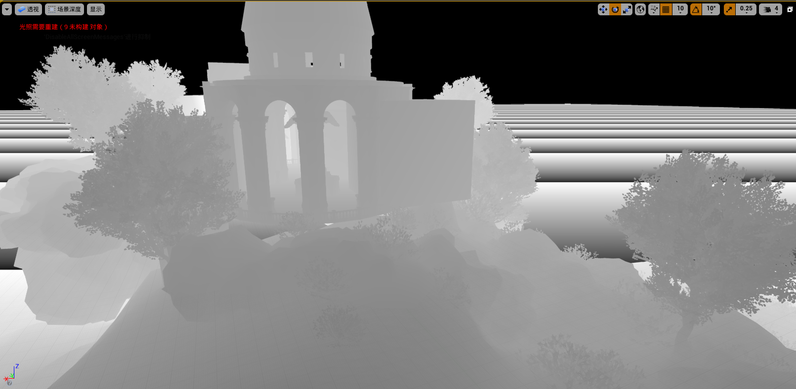
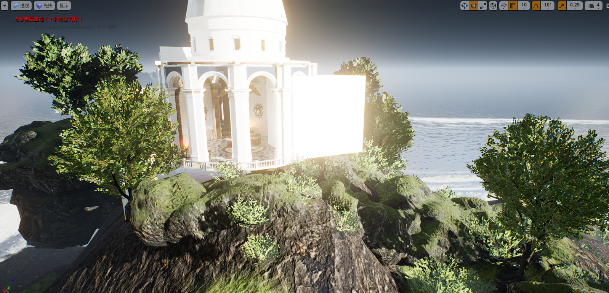
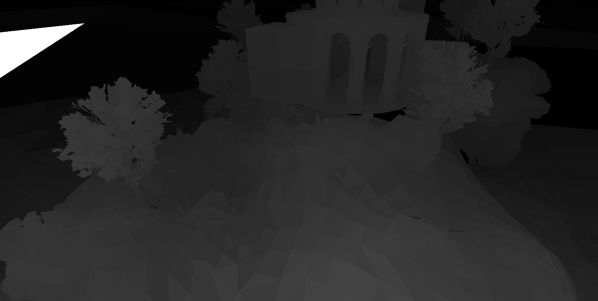

SIMD Test
===

> SunTemple scene contains **660k LOD0** triangless 
> Current raster rate is approx. **10k triangles/ms on desktop @3.5GHz** under resolution **1600x800**

* **ispc** tiled triangle rasterizer
* **compute shader** (SM6, DX12) tiled triangle rasterizer (**TODO**)
* unreal engine scene exporter