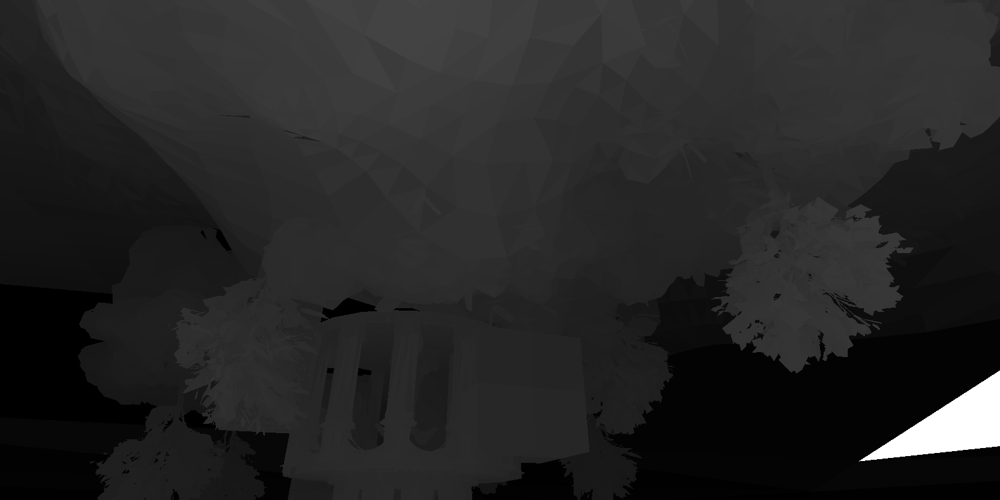

SIMD Test
===

> SunTemple scene contains **660k LOD0** triangless 

* **ispc** tiled triangle rasterizer
* **compute shader** (SM6, DX12) tiled triangle rasterizer (**TODO**)
* unreal engine scene exporter